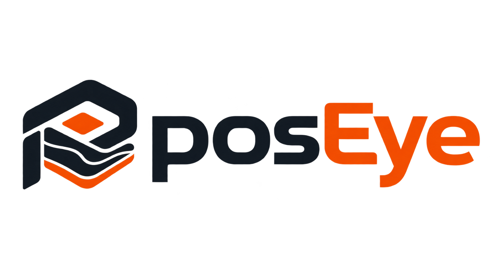
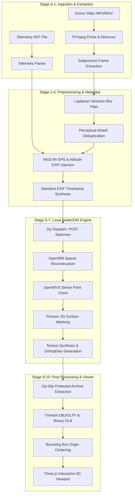

# posEye

<div align="center">
  
  <p><strong>Offline Drone Video Photogrammetry & 3D Reconstruction System for Windows</strong></p>

  [](https://github.com/Atharv3142M/posEye/actions/workflows/ci.yml)
  [](https://github.com/Atharv3142M/posEye/releases/tag/v0.1.4)
  [](https://github.com/Atharv3142M/posEye)
  [](LICENSE)
  [](https://www.python.org/)
  [](https://opendronemap.org/)
</div>

---

## Executive Overview

**posEye** is a standalone Windows desktop photogrammetry application engineered to convert standard drone flight videos (`.mp4`, `.mov`) and companion telemetry (`.srt`) into georeferenced, interactive 3D surface models and GIS deliverables. Designed for site inspection, infrastructure evaluation, disaster response, and robotics simulation, posEye automates the entire photogrammetry lifecycle with zero manual intermediate steps and zero external cloud dependencies.

All video decoding, frame extraction, sharpness analysis, EXIF coordinate injection, Structure from Motion (SfM) bundle adjustment, multi-view stereo meshing, and WebGL rendering execute locally on the host workstation. Imagery and coordinate data remain strictly isolated on host storage.

---

## System Architecture & Pipeline

posEye coordinates frame preprocessing, containerized photogrammetry, post-processing conversion, and WebGL visualization through an 11-stage state-machine pipeline:


```mermaid
flowchart TD
    subgraph Ingestion ["Stage 0-1: Ingestion & Extraction"]
        A[Drone Video MP4/MOV] --> B[FFmpeg Probe & Demuxer]
        B --> C[Subprocess Frame Extraction]
        D[Telemetry SRT File] --> E[Telemetry Parser]
    end

    subgraph Preprocessing ["Stage 2-4: Preprocessing & Metadata"]
        C --> F[Laplacian Variance Blur Filter]
        F --> G[Perceptual dHash Deduplication]
        E & G --> H[WGS 84 GPS & Altitude EXIF Injection]
        H --> I[Standard EXIF Timestamp Synthesis]
    end

    subgraph Photogrammetry ["Stage 5-7: Local NodeODM Engine"]
        I --> J[Zip Dispatch: POST /task/new]
        J --> K[OpenSfM Sparse Reconstruction]
        K --> L[OpenMVS Dense Point Cloud]
        L --> M[Poisson 3D Surface Meshing]
        M --> N[Texture Synthesis & Orthophoto Generation]
    end

    subgraph Inspection ["Stage 8-10: Post-Processing & Viewer"]
        N --> O[Zip-Slip Protected Archive Extraction]
        O --> P[Trimesh OBJ/GLTF to Binary GLB]
        P --> Q[Bounding Box Origin Centering]
        Q --> R[Three.js Interactive 3D Viewport]
    end
```

### Pipeline Lifecycle Stages

| Phase | State | Operational Responsibility |
|---|---|---|
| **01** | `validating` | Probes container integrity, codec streams, resolution, framerate, and duration via FFmpeg. |
| **02** | `extracting` | Samples video frames at configurable target rates via managed background subprocesses. |
| **03** | `filtering` | Evaluates OpenCV Laplacian variance to discard blurred frames and computes 64-bit difference hashes (`dHash`) to eliminate static near-duplicates. |
| **04** | `geotagging` | Parses DJI/Autel SRT logs, performs nearest-neighbor temporal matching (1.5s window), and injects WGS 84 DMS coordinates, AMSL altitude, and ISO timestamps into JPEG EXIF. |
| **05** | `masking` | *(Optional)* Evaluates YOLOv8 object segmentation to generate dynamic obstruction masks (`_mask.JPG`), eliminating transient vehicles or personnel from bundle adjustment. |
| **06** | `uploading` | Packages geotagged frames into an in-memory archive and dispatches via multipart POST to the local NodeODM container. |
| **07** | `reconstructing` | Monitors OpenDroneMap processing phases (OpenSfM camera alignment, OpenMVS densification, Poisson surface meshing, texturing, and orthophoto generation) via incremental log streaming. |
| **08** | `postprocessing` | Validates and unpacks NodeODM archives using canonical path normalization to prevent directory traversal and decompression bombs. |
| **09** | `converting` | Converts textured OBJ meshes to binary glTF (`model.glb`), verifying header magic, vertex buffers, and bounding box dimensions. |
| **10** | `ready` | Transitions to an immutable completion state, hydrates metadata, and streams the 3D model into the WebGL viewport. |

---

## Release v0.1.4: Distribution & Verification

The current release candidate is **posEye v0.1.4**, packaged as a standard Windows 10/11 x64 NSIS installer.

- **Installer Executable:** `posEye.Setup.0.1.4.exe`
- **File Size:** `192,247,632` bytes (~183.34 MB)
- **SHA-256 Digest:** `9B0BA01B12B09545DF0F19EFC48C2816F25B3F78472F086D50CED2677F4BF3C5`
- **Distribution Portal:** [GitHub Releases: posEye v0.1.4](https://github.com/Atharv3142M/posEye/releases/tag/v0.1.4)
- **Release Documentation:** [Docs/RELEASE_NOTES_v0.1.4.md](Docs/RELEASE_NOTES_v0.1.4.md)

### Cryptographic Verification

Prior to executing the installer, verify the integrity of the binary using PowerShell:

```powershell
$expectedHash = "9B0BA01B12B09545DF0F19EFC48C2816F25B3F78472F086D50CED2677F4BF3C5"
$actualHash = (Get-FileHash -Path .\posEye.Setup.0.1.4.exe -Algorithm SHA256).Hash
if ($actualHash -eq $expectedHash) {
    Write-Host "[OK] Cryptographic verification passed: $actualHash" -ForegroundColor Green
} else {
    Write-Error "[FAIL] Hash mismatch! Expected $expectedHash, got $actualHash"
}
```

### Component Distribution Model

| Component | Bundled in Installer | External Prerequisite | Notes |
|---|:---:|:---:|---|
| **Electron Shell & UI** | Yes | No | Chromium 128 / Node 20 runtime environment. |
| **Static FFmpeg Engine** | Yes | No | Pre-compiled static binary (`third_party/ffmpeg.exe`). |
| **posEye.Orchestrator** | Yes | No | PyInstaller standalone executable with Windows version resources. |
| **Docker Desktop** | No | **Yes** | Requires Docker Desktop with the WSL2 backend enabled. |
| **NodeODM Engine** | No | **Yes** | Docker image `opendronemap/nodeodm:3.6.2` (pulled once locally). |

---

## System Requirements

### Hardware Prerequisites

| Resource | Minimum Specification | Recommended Specification |
|---|---|---|
| **Operating System** | Windows 10 64-bit (Build 19041+) | Windows 11 64-bit (Build 22000+) |
| **Processor** | 6-core x86_64 CPU (Intel i5/i7 10th Gen+ or AMD Ryzen 5000+) | 16+ core x86_64 CPU (AMD Ryzen 9 / Threadripper, Intel i9) |
| **System Memory** | 16 GB DDR4/DDR5 RAM | 32 GB–64 GB RAM (prevents OOM during OpenMVS dense meshing) |
| **Local Storage** | 25 GB free space on SSD | 100+ GB high-speed NVMe SSD (scratch frame extraction & outputs) |
| **GPU / Graphics** | DirectX 11 / WebGL 2.0 compatible GPU | NVIDIA GeForce RTX 3060+ / RTX 4000 Ada with CUDA capability |
| **Firmware** | Virtualization enabled in BIOS/UEFI (VT-x / AMD-V) | Hyper-V / Virtual Machine Platform active |

### Software Prerequisites

1. **WSL2 Subsystem:** Windows Subsystem for Linux 2 must be installed and functional.
2. **Docker Desktop:** Configured to utilize the WSL2 backend.
3. **NodeODM Container Image:** Pinned image `opendronemap/nodeodm:3.6.2` must be loaded into the local Docker image cache.

---

## Installation & Operator Setup

### Step 1: Prepare Docker Desktop & WSL2

1. Install [Docker Desktop for Windows](https://www.docker.com/products/docker-desktop/).
2. In Docker Desktop Settings:
   - Navigate to **General** $\rightarrow$ Ensure **Use the WSL 2 based engine** is checked.
   - Navigate to **Resources** $\rightarrow$ **WSL Integration** $\rightarrow$ Enable integration with your default distro.
3. Start Docker Desktop and verify daemon connectivity via PowerShell:
   ```powershell
   docker info
   ```

### Step 2: Provision NodeODM Engine

Pull the validated OpenDroneMap processing image:

```powershell
docker pull opendronemap/nodeodm:3.6.2
```

*(Note: The download is ~1.5 GB compressed. Once downloaded, processing runs completely offline.)*

### Step 3: Run the posEye Setup Wizard

1. Download `posEye.Setup.0.1.4.exe` and confirm the SHA-256 hash.
2. Run the installer and complete the setup wizard.
3. Launch **posEye** from the Start Menu or desktop shortcut.
4. On startup, posEye completes background engine discovery (< 300ms) and verifies loopback API endpoints.

---

## User Workflow & Operational Guide

```text
[Dashboard] ──> [New Project] ──> [Processing HUD] ──> [3D Viewer & Analysis] ──> [Export]
```

1. **Project Configuration:**
   - Click **New Project** from the sidebar or dashboard.
   - Select your drone video file (`.mp4`, `.mov`). The system instantly probes duration, resolution, frame rate, and estimated extractable frames.
   - Select the matching telemetry track (`.srt`). If omitted, posEye processes the footage in uncalibrated relative mode.
   - Select a reconstruction preset:
     - **Fast / Low Quality:** 1280px downsampling, sparse feature matching. Optimized for rapid scene verification.
     - **Balanced / Default:** 2048px downsampling, medium density point cloud. Ideal for standard site inspection.
     - **High Precision:** Native resolution, dense Poisson meshing, 4096px texture atlas generation.

2. **Automated Pipeline Execution:**
   - Click **Start Processing**.
   - The Processing view displays real-time elapsed time (`MM:SS`), an active 11-stage progress timeline, and an expandable terminal streaming live OpenSfM/OpenMVS output.
   - Jobs can be safely cancelled at any point; subprocesses are gracefully terminated and temporary files purged.

3. **Interactive 3D Model Inspection:**
   - Upon completion, the 3D model automatically mounts in the WebGL viewport.
   - **Navigation:** Left-click + drag to orbit; Right-click + drag to pan; Scroll wheel to zoom.
   - **Camera Reset:** Press `R` on the keyboard or click **Reset View** to fit the viewport to the model's bounding box.
   - **Model Statistics:** Inspect verified vertex and triangle counts derived directly from buffer attributes.
   - **Point-to-Point Measurement:** Activate the **Measure Tool**, hover over mesh surfaces to locate snap points, and place Point A and Point B to calculate Euclidean distance.

4. **Deliverable Export:**
   - Export deliverables directly from the Viewer toolbar or project detail panel:
     - **3D Mesh:** Textured Binary glTF (`model.glb`).
     - **Dense Point Cloud:** ASPRS LiDAR format (`point_cloud.laz`).
     - **Orthophoto:** Georeferenced raster (`orthophoto.tif`).
     - **Quality Report:** Complete OpenDroneMap diagnostic documentation (`report.pdf`).

---

## Geospatial Accuracy & Limitations

posEye maintains strict mathematical honesty regarding geospatial accuracy boundaries. Reconstructions reflect the accuracy of the input telemetry and camera calibration:

```text
┌────────────────────────────────────────────────────────────────────────┐
│                        GEOSPATIAL ACCURACY SPECIFICATION               │
├──────────────────────────┬───────────────────────┬─────────────────────┤
│ Input Mode               │ Horizontal / Vertical │ Scale Attribution   │
├──────────────────────────┼───────────────────────┼─────────────────────┤
│ Standard Drone GNSS (SRT)│ ±2.0 m – 5.0 m        │ Metric (Meters)     │
│ Video Only (No SRT)      │ None (Unreferenced)   │ Arbitrary (Units)   │
│ Survey Ground Control    │ Sub-decimeter (Target)│ Ground Truth        │
└──────────────────────────┴───────────────────────┴─────────────────────┘
```

1. **Consumer GNSS Limitations:** Commercial camera drones (e.g., DJI Mini/Air, Autel) employ single-frequency GPS/GLONASS receivers subject to ionospheric delay and multipath interference. While relative geometry between consecutive frames is precise ($\approx 0.05 - 0.2$ m), absolute global positioning carries standard consumer GPS variance ($\pm 2 - 5$ m).
2. **Relative Scale Warning:** If video is processed without an `.srt` telemetry track or EXIF geotags, monocular Structure from Motion cannot resolve metric scale. In this mode, posEye explicitly flags the model as uncalibrated and formats all measurements in **model units** rather than meters.
3. **Vertical Datum & Altitude:** posEye extracts Absolute Mean Sea Level (AMSL) altitude whenever reported by the telemetry stream and encodes the EXIF `GPSAltitudeRef` byte flag (`0` = Above Sea Level, `1` = Below Sea Level). Relative takeoff altitude (`rel_alt`) is never promoted to absolute altitude.
4. **Not Certified for Cadastral Surveying:** Models generated without surveyed Ground Control Points (GCPs) or RTK/PPK base station correction are intended for situational awareness, asset reconnaissance, visual inspection, and preliminary dimensioning. They are not certified for legal property boundary demarcation or civil engineering sign-off.

For full technical derivation and datum transformations, refer to [Docs/GEOREFERENCING_AND_ACCURACY.md](Docs/GEOREFERENCING_AND_ACCURACY.md).

---

## Developer Environment & Test Suite

### Development Environment Setup

Ensure Python 3.10+, Node.js 20+, and PowerShell 7+ are available.

```powershell
# 1. Clone repository
git clone https://github.com/Atharv3142M/posEye.git
cd posEye

# 2. Bootstrap Python virtual environment and dependencies
.\scripts\setup.ps1

# 3. Provision static FFmpeg binary into third_party/
.\scripts\fetch-ffmpeg.ps1

# 4. Install desktop frontend dependencies
cd apps\desktop
npm ci
cd ..\..
```

### Automated Test Execution

The posEye test suite verifies core extraction algorithms, EXIF coordinate conversion, state machine transitions, archive security, and API endpoints:

```powershell
# Execute full Python test suite (47 passed tests)
.\.venv\Scripts\python.exe -m pytest apps\pipeline apps\orchestrator -v

# Perform TypeScript type checking
cd apps\desktop
npx tsc --noEmit

# Execute frontend Vite production build
npm run build
```

### Packaging the Application

```powershell
# Package the standalone posEye.Orchestrator executable (PyInstaller)
.\scripts\build-orchestrator.ps1

# Build the unpacked Electron distribution
cd apps\desktop
npm run pack

# Build the signed/unsigned NSIS Windows Installer
npm run dist
```

Outputs are generated in `apps/desktop/release/posEye.Setup.0.1.4.exe`.

---

## Repository Structure

```text
posEye/
├── .github/workflows/         Continuous integration and release validation pipelines
├── apps/
│   ├── desktop/               Electron main process, preload bridge, and React UI
│   │   ├── electron/          main.cjs (IPC, window lifecycle, background engine setup)
│   │   └── src/renderer/      React 18 components, Three.js viewport, Zustand stores
│   ├── orchestrator/          FastAPI backend, JobStore state machine, NodeODM client
│   │   ├── src/orchestrator/  main.py, jobs.py, nodeodm.py, convert.py, system.py
│   │   └── tests/             Automated API and job lifecycle regression tests
│   └── pipeline/              Photogrammetry preprocessing & frame extraction
│       ├── src/pipeline/      extract.py, filters.py, srt.py, exif.py, ffmpeg.py
│       └── tests/             Geospatial, telemetry parser, and filtering tests
├── Docs/                      Technical architecture specs, audits, and release notes
├── installer/                 Inno Setup scripts, NSIS packaging configurations
├── scripts/                   PowerShell automation for setup, builds, and containers
├── third_party/               Pre-compiled static binaries (ffmpeg.exe, posEye.Orchestrator.exe)
├── CHANGELOG.md               Comprehensive project release history
├── CONTRIBUTING.md            Contribution guidelines and coding standards
├── LICENSE                    MIT open-source license
├── posEye.ico                 Windows multi-resolution application icon (16x16 to 256x256)
├── posEye.png                 Official project logo
├── pytest.ini                 Pytest test runner configuration
├── README.md                  Public repository documentation
├── SECURITY.md                Vulnerability reporting and security disclosures
└── THIRD_PARTY_NOTICES.md     Third-party open-source attribution and licenses
```

---

## Technical Documentation Index

| Document | Purpose & Scope |
|---|---|
| [Docs/CURRENT_STATE.md](Docs/CURRENT_STATE.md) | Verified engineering state, active capabilities, and test results. |
| [Docs/MVP_Spec.md](Docs/MVP_Spec.md) | Canonical architectural specification and success criteria. |
| [Docs/GEOREFERENCING_AND_ACCURACY.md](Docs/GEOREFERENCING_AND_ACCURACY.md) | In-depth mathematical analysis of GPS parsing, EXIF tags, and coordinate projections. |
| [Docs/VIEWER_ARCHITECTURE.md](Docs/VIEWER_ARCHITECTURE.md) | Technical design of the Three.js viewport, geometry centering, and measurement HUD. |
| [Docs/ENGINE_EVALUATION_v0.1.4.md](Docs/ENGINE_EVALUATION_v0.1.4.md) | Comparative evaluation between OpenDroneMap, WebODM, and native alternatives. |
| [Docs/RELEASE_NOTES_v0.1.4.md](Docs/RELEASE_NOTES_v0.1.4.md) | Full changelog, bug fixes, and upgrade notes for release v0.1.4. |
| [Docs/RELEASE_ARTIFACT_AUDIT_v0.1.4.md](Docs/RELEASE_ARTIFACT_AUDIT_v0.1.4.md) | Cryptographic audit, file sizes, and binary inspection of the v0.1.4 release installer. |
| [Docs/TROUBLESHOOTING.md](Docs/TROUBLESHOOTING.md) | Operator diagnostic runbook for Docker, WSL2, GPU detection, and FFmpeg issues. |
| [Docs/TESTING.md](Docs/TESTING.md) | Comprehensive test matrix and continuous integration verification commands. |
| [Docs/WEBODM_COMPARISON.md](Docs/WEBODM_COMPARISON.md) | Architectural comparison against full-stack WebODM installations. |

---

## Security, Privacy & Integrity Policy

1. **Loopback Network Isolation:** Both the Python Orchestrator API (`:8765`) and the NodeODM service (`:3000`) bind strictly to `127.0.0.1`. Remote network access is denied by default.
2. **Session Authentication:** The orchestrator enforces dynamic, session-scoped cryptographic bearer tokens (`DT_API_TOKEN`) across all REST endpoints and WebSocket connections.
3. **Archive Security:** Decompression routines enforce strict canonical path boundaries, neutralizing Zip-Slip directory traversal attempts and decompression bombs.
4. **Cross-Origin & IPC Isolation:** The orchestrator API restricts CORS strictly to local desktop Electron origins (`null`, `file://`, `127.0.0.1:5173`, `localhost:5173`), preventing external web origins from interacting with the loopback orchestrator. Electron IPC handlers enforce strict sender validation (`isTrustedSender`).
5. **Data Privacy:** posEye collects zero telemetry, crash reports, or user analytics. All media assets, coordinates, and reconstructed models remain exclusively on the user's local disk.

For vulnerability disclosure procedures, refer to [SECURITY.md](SECURITY.md).

---

## License & Attribution

posEye is released under the [MIT License](LICENSE).

posEye incorporates open-source photogrammetry and media technologies:
- **OpenDroneMap (ODM) / NodeODM:** GNU General Public License v3.
- **FFmpeg:** GNU Lesser General Public License (LGPL) / GPL.
- **Three.js:** MIT License.
- **OpenCV:** Apache 2 License.

Refer to [THIRD_PARTY_NOTICES.md](THIRD_PARTY_NOTICES.md) for full legal text and third-party dependency disclosures.
